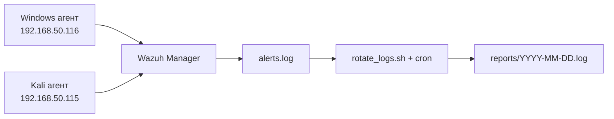
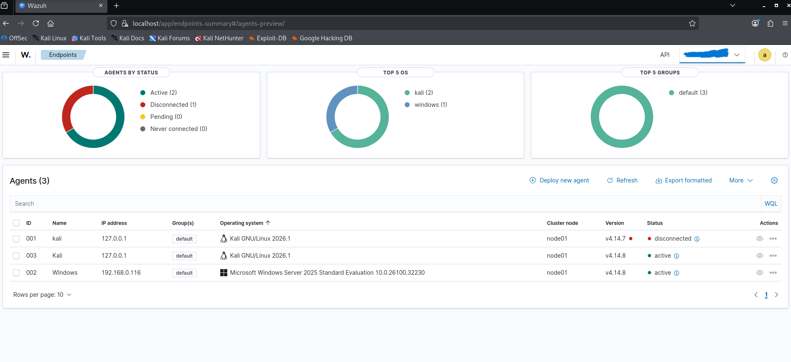
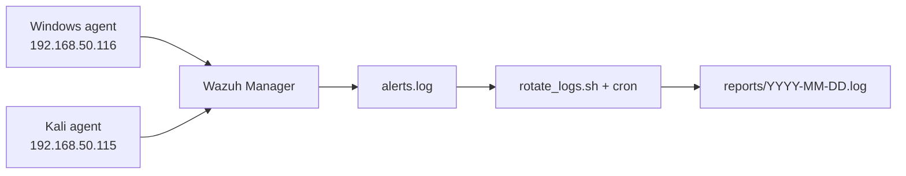

<div align="center">

# 🛡️ Home SOC Lab: Wazuh SIEM & Log Automation

**Домашній SOC-стенд: Wazuh SIEM та автоматизація логування**


🇺🇦 [Українська версія](#ua) · 🇬🇧 [English version](#en)

</div>

---

<a id="ua"></a>

# 🇺🇦 Українська версія

## 📌 1. Про проєкт та його призначення

Цей проєкт є повноцінним лабораторним стендом **Центру моніторингу безпеки (SOC)**, розгорнутим у середовищі Docker.

Його головна мета — продемонструвати навички:

- розгортання систем керування подіями та інформацією безпеки (**SIEM**);
- налаштування централізованого збору логів з гетерогенних операційних систем (**Linux** та **Windows**);
- реалізації легковагової автоматизації для портфоліо.

## 🏗️ 2. Архітектура та технологічний стек

| Компонент | Опис |
|---|---|
| **SIEM-платформа** | Wazuh (Manager, Indexer, Dashboard), розгорнута за допомогою Docker Compose |
| **Хост / Linux-агент** | Kali Linux (`192.168.50.115`) — хост для Docker-контейнерів та одночасно агент спостереження |
| **Windows-агент** | Windows-машина (`192.168.50.116`), підключена до центрального менеджера через захищений канал |
| **Автоматизація** | Кастомний Bash-скрипт та планувальник `cron` |

## 📂 3. Структура проєкту

```plaintext
soc-wazuh/
├── reports/        # Зрізи звітів безпеки з ротацією (зберігаються останні 7 днів)
├── scripts/        # Автоматизовані скрипти (скрипт ротації rotate_logs.sh)
├── wazuh-docker/   # Конфігурації Docker Compose для розгортання Wazuh
└── README.md       # Документація проєкту
```

## ⚙️ 4. Логіка збору логів та автоматизація

Система працює за принципом безперервного агенто-орієнтованого збору:

1. **Агенти** на Windows та Kali Linux збирають системні події (Windows Event Logs, аутентифікація тощо) та надсилають їх на центральний менеджер (`single-node-wazuh.manager-1`).
2. **Менеджер** агрегує дані у файл `/var/ossec/logs/alerts/alerts.log`.
3. **Скрипт автоматизації** (`scripts/rotate_logs.sh`) за розкладом (cron) робить зріз останніх подій, зберігає їх у папці `reports/` у форматі `YYYY-MM-DD.log` та автоматично видаляє файли, старші за 7 днів.



## 🚀 5. Інструкція з використання та налаштування

### Крок 1. Розгортання платформи

Перейдіть у папку конфігурацій та запустіть контейнери:

```bash
cd wazuh-docker/single-node
docker compose up -d
```

### Крок 2. Підключення агентів (IP-адреси)

Якщо ви змінюєте мережеве середовище або IP-адреси, переконайтеся, що:

- IP-адреса менеджера у файлі конфігурації агента на Windows (`C:\Program Files (x86)\ossec-agent\ossec.conf`) відповідає вашому хосту (`192.168.50.115`);
- порти Wazuh (`1514`, `1515` тощо) відкриті у брандмауері.

### Крок 3. Налаштування обсягу логів

У скрипті ротації (`scripts/rotate_logs.sh`) за замовчуванням збираються останні **500** подій (`tail -n 500`), щоб не перевантажувати репозиторій на GitHub зайвими даними:

```bash
docker exec single-node-wazuh.manager-1 tail -n 500 /var/ossec/logs/alerts/alerts.log > "$LOG_DIR/$CURRENT_DATE.log"
```

> 💡 **Як змінити:** замініть число `500` на потрібне, наприклад `1000` для більшої деталізації або `100` для компактності.

### Крок 4. Налаштування щоденного автозапуску (cron)

Щоб скрипт виконувався автоматично 1 раз на добу:

1. Відкрийте редактор завдань:

```bash
   crontab -e
```

2. Додайте рядок для запуску опівночі:

```bash
   0 0 * * * /bin/bash /шлях_до_проєкту/soc-wazuh/scripts/rotate_logs.sh >/dev/null 2>&1
```

---

### Скріншоти стенду


<a id="en"></a>

# 🇬🇧 English version

## 📌 1. Project Overview & Purpose

This project is a fully containerized **Home Security Operations Center (SOC)** lab built using Docker.

Its primary goal is to demonstrate competencies in:

- deploying **Security Information and Event Management (SIEM)** systems;
- configuring centralized log collection from heterogeneous endpoints (**Linux** and **Windows**);
- implementing lightweight automation practices suitable for a professional portfolio.

## 🏗️ 2. Architecture & Tech Stack

| Component | Description |
|---|---|
| **SIEM Platform** | Wazuh (Manager, Indexer, Dashboard) deployed via Docker Compose |
| **Host / Linux Agent** | Kali Linux (`192.168.50.115`), serving as the Docker host and a monitored Linux endpoint |
| **Windows Agent** | Windows machine (`192.168.50.116`), connected securely to the central manager |
| **Automation** | Custom Bash scripting and `cron` scheduler |

## 📂 3. Project Structure

```plaintext
soc-wazuh/
├── reports/        # Daily security report snapshots with a 7-day retention policy
├── scripts/        # Automation scripts (log rotation utility: rotate_logs.sh)
├── wazuh-docker/   # Docker Compose configuration files for Wazuh deployment
└── README.md       # Project documentation
```

## ⚙️ 4. Log Collection Logic & Automation

The pipeline relies on continuous agent-based streaming:

1. **Windows and Kali Linux agents** collect local system events (Event Logs, authentication logs) and stream them to the central manager (`single-node-wazuh.manager-1`).
2. **The manager** aggregates events into `/var/ossec/logs/alerts/alerts.log`.
3. **A scheduled automation script** (`scripts/rotate_logs.sh`) extracts a snapshot of recent alerts, saves them into the `reports/` directory as `YYYY-MM-DD.log`, and purges logs older than 7 days.



## 🚀 5. Usage & Configuration Guide

### Step 1. Deploying the Platform

Navigate to the configuration directory and start the containers:

```bash
cd wazuh-docker/single-node
docker compose up -d
```

### Step 2. Configuring IP Addresses & Agents

If your network environment changes, ensure that:

- the manager IP address inside the Windows agent configuration (`C:\Program Files (x86)\ossec-agent\ossec.conf`) matches your host (`192.168.50.115`);
- Wazuh communication ports (`1514`, `1515`) are accessible.

### Step 3. Customizing Log Volume

The log rotation script (`scripts/rotate_logs.sh`) captures the last **500** events (`tail -n 500`) by default to prevent bloating the GitHub repository with massive raw datasets:

```bash
docker exec single-node-wazuh.manager-1 tail -n 500 /var/ossec/logs/alerts/alerts.log > "$LOG_DIR/$CURRENT_DATE.log"
```

> 💡 **How to modify:** simply change the `500` parameter to your preferred value, e.g. `1000` for deeper analysis or `100` for compact storage.

### Step 4. Setting up Daily Automation (cron)

To run the script automatically once per day:

1. Open the cron table editor:

```bash
   crontab -e
```

2. Add the following entry to execute it every day at midnight:

```bash
   0 0 * * * /bin/bash /absolute_path_to_project/soc-wazuh/scripts/rotate_logs.sh >/dev/null 2>&1
```
### Screenshots

